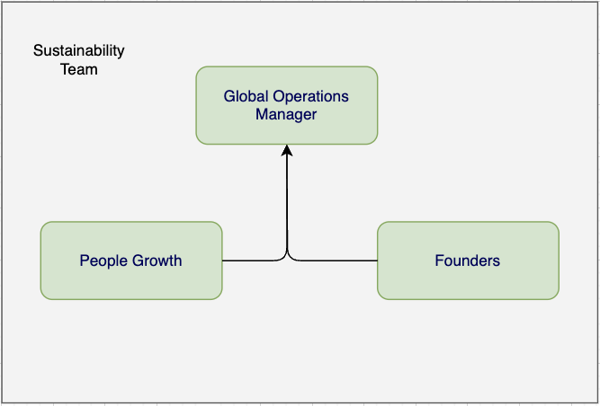

# Equipo de sustentabilidad

El esfuerzo de sustentabilidad es un esfuerzo transversal a la organización. El equipo de sustentabilidad no solo debe diseñar estrategias y medir el impacto ambiental de la empresa, sino que también debe actuar como un agente de cambio interno y externo, fomentando la responsabilidad ambiental, la innovación sostenible y la transparencia en la comunicación de sus avances. 

Este enfoque garantizará que la empresa no solo cumpla con sus obligaciones ambientales, sino que también genere un impacto positivo y diferenciado en su industria. 🌍♻️

El equipo está compuesto por el Global Operations Manager como lider de equipo, un representante de People Growth y un representante de los fundadores.

### **Responsabilidades del Equipo de Sustentabilidad en una Empresa**

Un equipo de sustentabilidad dentro de una empresa tiene la responsabilidad de desarrollar e implementar estrategias sostenibles alineadas con los objetivos corporativos y las normativas ambientales vigentes. Sus principales funciones incluyen:

---

## **1. Desarrollo de la Estrategia de Sustentabilidad**  
✅ **Definir la Visión y Misión en Sustentabilidad**  
- Asegurar que la estrategia esté alineada con los valores y objetivos generales de la empresa.  
- Integrar principios de economía circular, reducción de emisiones y eficiencia energética.  

✅ **Identificar Áreas de Impacto**  
- Evaluar los principales impactos ambientales de la empresa en su operación digital o física.  
- Priorizar áreas como consumo energético, proveedores, transporte y residuos electrónicos (e-waste).  

✅ **Cumplimiento Normativo y de Certificaciones**  
- Asegurar el cumplimiento de regulaciones internacionales (como el Acuerdo de París).  
- Explorar certificaciones ambientales como ISO 14064 (huella de carbono) o CarbonNeutral®.  

---

## **2. Medición de la Huella de Carbono**  
✅ **Recolección de Datos y Cálculo de Emisiones**  
- Identificar fuentes de emisión en Alcance 1, 2 y 3 (emisiones directas, indirectas y de la cadena de valor).  
- Implementar herramientas de medición y software especializado para calcular emisiones de CO₂.  

✅ **Análisis de Resultados y Establecimiento de una Línea Base**  
- Evaluar la huella actual de carbono y establecer un punto de referencia para reducir emisiones.  
- Comparar datos con estándares internacionales y benchmarks del sector.  

✅ **Informes y Auditorías**  
- Crear reportes de sostenibilidad con métricas clave y validaciones externas.  
- Participar en auditorías para garantizar la transparencia en la medición.  

---

## **3. Implementación de Acciones para Reducir la Huella de Carbono**  
✅ **Optimización Energética**  
- Migrar a energías renovables en servidores, oficinas y centros de datos.  
- Mejorar la eficiencia en la gestión de recursos digitales (almacenamiento en la nube verde, eficiencia en servidores).  

✅ **Reducción de Emisiones en la Cadena de Suministro**  
- Colaborar con proveedores que tengan prácticas sostenibles.  
- Evaluar el impacto de los servicios digitales y su huella de carbono.  

✅ **Política de Trabajo Sostenible**  
- Implementar estrategias de movilidad baja en carbono para los empleados (teletrabajo optimizado, reuniones virtuales en vez de viajes innecesarios).  
- Fomentar la reducción de residuos electrónicos y promover su reciclaje adecuado.  

✅ **Compensación de Emisiones Residuales**  
- Invertir en proyectos de reforestación o captura de carbono.  
- Participar en programas de créditos de carbono certificados.  

---

## **4. Comunicación y Reportes de Progreso**  
✅ **Transparencia y Divulgación de Información**  
- Publicar reportes anuales de sustentabilidad con datos medibles y verificables.  
- Comunicar avances y desafíos en la reducción de la huella de carbono a stakeholders.  

✅ **Educación y Cultura de Sustentabilidad**  
- Crear programas de formación para empleados sobre prácticas sostenibles.  
- Involucrar a toda la empresa en iniciativas de reducción de impacto ambiental.  

✅ **Relación con Inversionistas y Reguladores**  
- Responder a requisitos ESG (Environmental, Social & Governance) para atraer inversión sostenible.  
- Establecer relaciones con organismos reguladores y asociaciones del sector.  

---

## **5. Establecimiento de Metas Claras y Alcanzables**  
✅ **Definición de Objetivos SMART (Específicos, Medibles, Alcanzables, Relevantes y con Plazo Definido)**  
- Reducir en un X% la huella de carbono en 3, 5 o 10 años.  
- Alcanzar la neutralidad de carbono para una fecha específica.  

✅ **Evaluación y Ajuste de Estrategias**  
- Revisar periódicamente el desempeño y adaptar las estrategias según los resultados obtenidos.  
- Incorporar innovaciones tecnológicas para mejorar el desempeño ambiental.  

---

